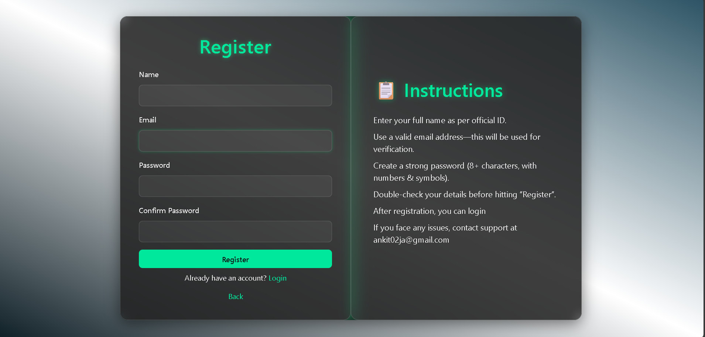

# Budget Buddy 💰

**Budget Buddy** is an ASP.NET Core MVC based Expense Tracker application that helps you track your daily expenses, manage categories, and generate reports with an easy-to-use and modern UI.  
It includes advanced features such as **PDF export**, **authentication system**, and an **FAQ assistant**.


---

## 🚀 Features

- User Registration with Email Verification
- Secure Login and Logout using ASP.NET Core Identity
- Change Password and Remember Me option
- Expense and Category Management (Add, Edit, Delete , update)
- Transaction list to view all expenses
- Interactive Dashboard with charts and statistics
- Monthly and yearly expense summaries
- Category-wise expense visualization
- Export expenses as PDF
- FAQ Assistant for quick help
- Responsive modern UI with dark theme and glassmorphism design
- Syncfusion UI components for smooth interaction

---

## 🛠 Technology Stack

- **Frontend:** HTML, CSS, JS, Bootstrap, Syncfusion UI  
- **Backend:** ASP.NET Core MVC , Entity Framework Core (Code First)  
- **Database:**  MS SQL Server  
- **PDF Export:** QuestPDF  
- **Authentication:** ASP.NET Core Identity  

---

## 📦 Installation

1. **Clone the repository**
   ```bash
   git clone https://github.com/Ankitsinghhhh/Budget-Buddy-App.git

   ## 📷 Screenshots

### Login Page


#### Register Page


### change password


### verify email


### Dashboard


### PDF Export


### FAQ Assistant


### transaction


### category	

 
 ### Contact info
 Created by Ankit Singh 
 Feel free to connect for collaboration or queries
 email: ankit2ja@gmail.com